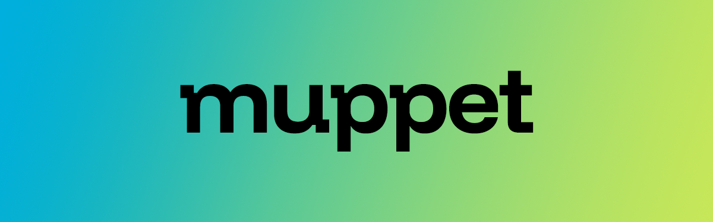

Muppet is an open-source toolkit designed to simplify the entire lifecycle of your Model Context Protocol (MCP) servers—from development and testing to deployment.

## Why Choose Muppet?

Muppet stands out by seamlessly integrating with the [Hono](https://hono.dev/) web framework. This integration allows you to enhance your existing Hono applications with MCP capabilities without the need for extensive rewrites. Muppet functions as a natural extension of Hono, providing an intuitive development experience.

## Key Use Cases

- **Enhance Existing Hono Applications:** Transform your current Hono app into a fully functional MCP server.
- **Develop New MCP Servers:** Build new MCP servers from scratch using Hono's robust framework.
- **OpenAPI-Based Development:** Create MCP servers guided by OpenAPI specifications for standardized API design.

## Advantages of Muppet

By leveraging Hono's features, Muppet enables you to incorporate essential functionalities into your MCP servers, such as:

- **Authentication:** Secure your MCP endpoints using Hono's authentication middleware.
- **CORS Management:** Effortlessly handle cross-origin requests.
- **Rate Limiting:** Protect your resources and ensure fair usage with built-in rate limiting.
- **Logging:** Monitor requests and responses using Hono's logging capabilities or integrate with third-party logging libraries.
- **Payment Integration:** Seamlessly incorporate billing and payment processes into your MCP workflows.

These features become increasingly valuable as your project scales, providing a robust foundation for efficient MCP management.

*Note: Muppet draws inspiration from the [hono-openapi](https://www.npmjs.com/package/hono-openapi) package. If you're familiar with `hono-openapi`, you'll find Muppet's design and philosophy comfortably aligned.*

## Getting Started

Select the path that aligns with your development goals:

### Quick Start Guides

<Cards>
  <Card title="For Server Developers" href="/docs/quickstart/server" description="Learn how to expose data and content from your servers to LLMs using Muppet." />
</Cards>

## Core Capabilities

Explore how to implement common functionalities with Muppet:

<Cards>
  <Card title="Resources" href="/docs/concepts/resources" description="Learn to expose data and content from your servers to LLMs." />
  <Card title="Prompts" href="/docs/concepts/prompts" description="Create reusable prompt templates and workflows." />
  <Card title="Tools" href="/docs/concepts/tools" description="Enable LLMs to perform actions through your server." />
  <Card title="Completions" href="/docs/concepts/completions" description="Implement autocompletion features for prompts and resource templates." />
</Cards>

## Contributing

We welcome contributions! Please refer to our [Contributing Guide](/docs/contributing) to learn how you can help improve Muppet.

## Support and Feedback

We're here to assist and value your feedback:

- **Bug Reports & Feature Requests:** [Create a GitHub issue](https://github.com/muppet-dev) for any issues or suggestions regarding the Muppet SDKs or documentation.
- **MCP Specification Discussions:** Join the [specification discussions](https://github.com/orgs/muppet-dev/discussions) for general discussions and Q&A about the Model Context Protocol.
